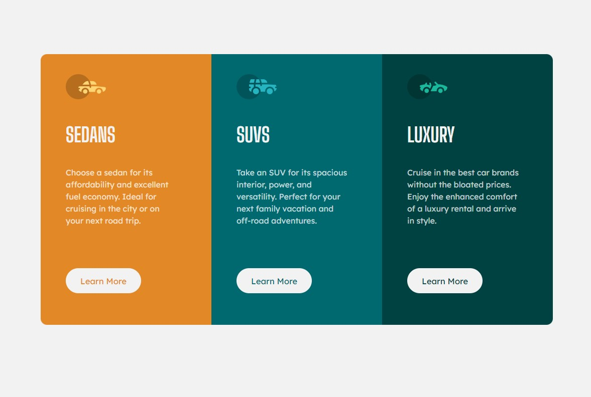

This is a solution to the [3-column preview card component challenge on Frontend Mentor](https://www.frontendmentor.io/challenges/3column-preview-card-component-pH92eAR2-). Frontend Mentor challenges help you improve your coding skills by building realistic projects. 

- [The challenge](#the-challenge)
- [Screenshot](#screenshot)
- [Links](#links)
- [Author](#author)

### The challenge

Users should be able to:

- View the optimal layout depending on their device's screen size
- See hover states for interactive elements

### Screenshot

### Links

- Live Site URL: [Add live site URL here](https://grinchcreator.github.io/3-column-preview-card-component/)

## Author

- Website - [Grinchcreator](https://grinchcreator.github.io/Personal-Website/)
- Frontend Mentor - [@Grinchcreator](https://www.frontendmentor.io/profile/Grinchcreator)

